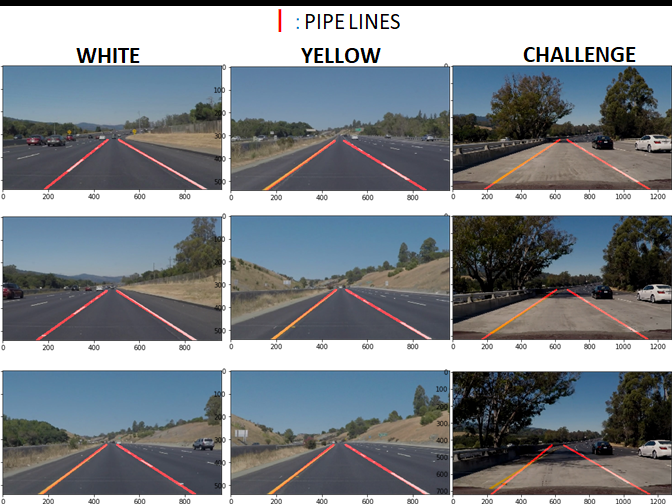

# **Finding Lane Lines on the Road** 

## Table of contents

---

1. Flow of processing  
  1.1 Load original images  
  1.2 Color selection  
  1.3 Gray scalling  
  1.4 Gaussian smoothing  
  1.5 Canny edge detection  
  1.6 Masked by region  
  1.7 Hough transform line detection  
  1.8 Draw pipe lines  

2. Especially examined points  
  2.1 Length weight addition  
  2.2 Set slope criteria

3. Conclusion


[//]: # (Image References)

[image1]: ./examples/grayscale.jpg "Grayscale"

---

## 1. Flow of processing


### 1.1 Original images  


### 1.2 Color selection  
I performed the following to extract the yellow line on the white road of the challenge.
```python
def yellow_white_extraction(img):

    yellow_white_image = np.copy(img)
    red_threshold = 80
    green_threshold = 180
    blue_threshold = 20
    rgb_threshold = [red_threshold, green_threshold, blue_threshold]
    
    thresholds = (img[:,:,0] < rgb_threshold[0]) \
                | (img[:,:,1] < rgb_threshold[1]) \
                | (img[:,:,2] < rgb_threshold[2])
    yellow_white_image[thresholds] = [0,0,0]
    
    return  yellow_white_image
```


### 1.3 Gray scalling  
I used cv2.cvtColor to gray scalling.  


### 1.4 Gaussian smoothing  
I used cv2.GaussianBlur to gaussian smoothing.  


### 1.5 Canny edge detection 
I used cv2.Canny to detect edges.  


### 1.6 Masked by region  
I used cv2.fillPoly to masked by region. 
Actually, only the inside of the yellow frame in the photo below remains, and the rest is masked black.  


### 1.7 Hough transform line detection 
I used cv2.HoughLinesP to make hough transform lines.  
The edges extracted only this time were made colorful to make them easy to understand.  


### 1.8 Draw pipe lines  
The slope and intercept of the line segment were calculated from the coordinates of the extracted edge.  
If the slope is negative then it is the left lane, if it is positive it is the right lane.  
Refer Chapter 2 for details on combining slopes and intercept groups to create a single pipeline.  


---

## 2. Especially examined points  

### 2.1 Length weight addition  


### 2.2 Set slope criteria  


## 3. Conclusion
This project was successful because the video images clearly show the lane lines are detected properly and lines are smoothly processed.

This straight line detection feature is very effective on long straight roads. However, under practical circumstances, limitations may be necessary due to the possibility of false detection of weather (any tire marks on snow road) , long shadows of buildings projected diagonally or road cracks etc.

In addition, since the position of the vanishing point greatly moves in the frame in the case of a steep curve or a steep up-down road such as a mountain road, another algorithm must be used in line detection.

### 1. Describe your pipeline. As part of the description, explain how you modified the draw_lines() function.

My pipeline consisted of 5 steps. First, I converted the images to grayscale, then I .... 

In order to draw a single line on the left and right lanes, I modified the draw_lines() function by ...

If you'd like to include images to show how the pipeline works, here is how to include an image: 

![alt text][image1]


### 2. Identify potential shortcomings with your current pipeline


One potential shortcoming would be what would happen when ... 

Another shortcoming could be ...


### 3. Suggest possible improvements to your pipeline

A possible improvement would be to ...

Another potential improvement could be to ...
